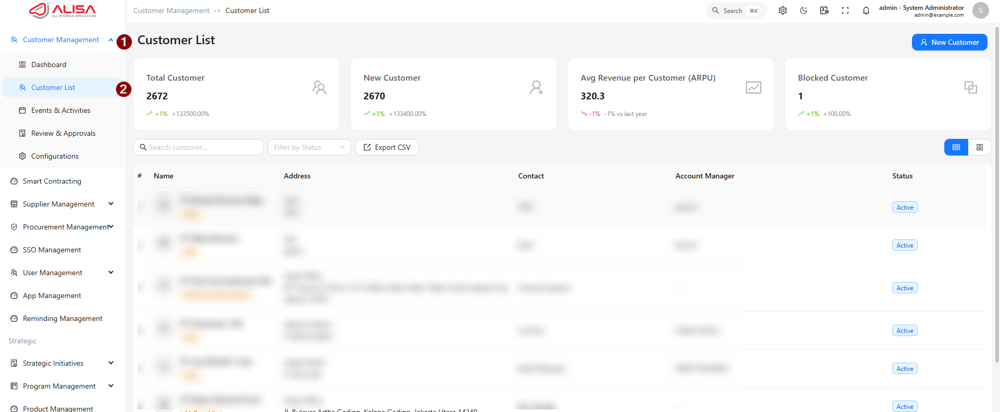

# Customer Management — ALISA 2.0

> **Selamat Datang!**
> Dokumen ini disusun untuk memberikan panduan operasional dalam mengelola database pelanggan melalui modul **Customer Management** pada sistem **ALISA 2.0**. Pastikan Anda mengikuti langkah-langkah yang tertera untuk menjaga akurasi data dan kelancaran proses bisnis.

## 1. Mengenal Modul Customer Management
Modul ini berfungsi sebagai **Single Source of Truth** (pusat data tunggal) untuk seluruh informasi pelanggan. 
Dengan modul ini, Anda dapat mengelola profil pelanggan secara terpusat, sehingga setiap divisi (Sales, Finance, hingga Legal) dapat berkolaborasi menggunakan data yang valid dan terintegrasi.

## 2. Fitur Utama
Sistem menyediakan kapabilitas berikut untuk mendukung produktivitas kerja:
* **Pengelolaan Master Data:** Pencatatan profil, kontak, dan struktur organisasi pelanggan.
* **Workflow Persetujuan:** Proses review dan approval digital untuk pendaftaran pelanggan baru.
* **Kontrol Status:** Manajemen status aktif atau blokir pelanggan secara sistematis.
* **Monitoring Aktivitas:** Pencatatan histori interaksi dan performa finansial pelanggan.
## 3. Panduan Penggunaan
Bagian ini menjelaskan tata cara teknis penggunaan fitur-fitur pada modul Customer Management.

### 3.1 Mengelola Daftar Customer (Customer List)
Halaman ini menampilkan seluruh data pelanggan yang terdaftar di dalam sistem, baik yang berstatus **Active** maupun **Blocked**. Melalui menu ini Anda dapat memantau database, menambahkan pelanggan baru, serta melihat atau memperbarui detail informasi pelanggan.

**Langkah-langkah:**
1. Pada **sidebar** di sisi kiri halaman utama, pilih menu **Customer Management**.
2. Klik pada submenu **Customer List**.
3. Sistem akan menampilkan tabel daftar pelanggan secara keseluruhan.

  
  
<i>Gambar: Tampilan Halaman Customer List</i>

  
  
<i>Gambar: Tampilan filter dan pencarian</i>

::: info CATATAN HAK AKSES
Anda wajib memiliki hak akses **View Customer** untuk dapat mengakses halaman ini. 

## 3.2.2 Membuat Customer Baru

Pengguna dapat menambah customer baru dengan mengikuti langkah-langkah berikut:

### Langkah-langkah:

1. Pada halaman **Customer List**, tekan tombol **+ New Customer**.
2. Lengkapi formulir pada tab-tab berikut:

* **Tab Address**: Isi data dasar seperti logo, nama customer, brand, kode unik, dan alamat lengkap. Pastikan centang **Main** untuk alamat utama.
* **Tab Sosial Media**: Masukkan URL media sosial (Youtube/Facebook) dan pastikan statusnya **Active**.
* **Tab Contacts**: Isi nama PIC, tanggal lahir, jabatan, email, dan nomor telepon.
* **Tab Structures**: Masukkan unit organisasi dan level hierarkinya.
* **Tab Groups**: Pilih kategori industri atau grup (misal: *Manufacture* atau *Retail*).
* **Tab Others**: Masukkan data tambahan seperti **Nomor SAP** atau **NPWP**.

3. Terakhir, tekan tombol **Save** untuk menyimpan.

---

::: info NOTE
* Kolom dengan tanda bintang (**\***) wajib diisi.
* Gunakan format **JPG/JPEG** untuk unggah logo.
* Data yang baru disimpan akan langsung muncul di daftar customer.
:::