# Funnel Management — ALISA 2.0

**Selamat Datang!**
Dokumen ini disusun untuk memberikan panduan operasional dalam mengelola siklus penjualan melalui modul **Funnel Management** pada sistem **ALISA 2.0**. 

Pastikan Anda mengikuti langkah-langkah yang tertera untuk menjaga akurasi data dan kelancaran penggunaan.

## 1. Mengenal Modul Funnel Management
Modul ini berfungsi untuk membantu digitalisasi dan standarisasi proses pengelolaan **Sales**, mulai dari tahap **Lead** hingga menjadi **Deal**. 

Dengan modul ini, Anda dapat memantau progres peluang secara transparan, sehingga tim Sales, Finance, hingga Direksi dapat berkolaborasi menggunakan data proyeksi yang valid dan terintegrasi.

## 2. Fitur Utama
Sistem menyediakan kapabilitas berikut untuk mendukung produktivitas kerja:
* **Lead Intake:** Pembuatan Lead, manajemen *Confidence Level* real-time, dan konversi otomatis menjadi Funnel.
* **Lifecycle Tracking:** Pelacakan tahapan (Prospect hingga Close), pemantauan SLA, dan riwayat aktivitas pelanggan.
* **Financial Management:** Perhitungan CoGS, penentuan tipe kontrak (Lumpsum/KHS), serta simulasi finansial (NPV, IRR, GPM).
* **Workflow & Reporting:** Alur persetujuan (Approval) bertingkat, manajemen dokumen SPH, serta dashboard statistik performa penjualan.

## 3. Panduan Penggunaan
Bagian ini menjelaskan tata cara teknis penggunaan fitur-fitur pada modul Funnel Management.

## 3.1 Menu Lead

Menu **Lead** adalah pintu utama masuknya peluang bisnis (*Lead Intake*). Di sini, Anda dapat meregistrasi prospek, mengelola tingkat keyakinan (*Confidence Level*), hingga memutuskan apakah prospek layak dikonversi menjadi **Funnel** atau di-**Drop**.

### 3.1.1 Lead List & Monitoring
Halaman ini merupakan dashboard utama untuk memantau seluruh prospek.

**Langkah-langkah:**
1. Pilih menu **Sales Management** > sub-menu **Leads**.

  
  
<i>Gambar: Halaman Customer List</i>

2. Gunakan fitur **Filter** Tahun, Status, atau kolom **Search** untuk mencari Lead spesifik.

  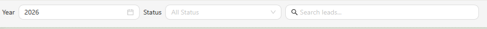
  
<i>Gambar: Filter Customer </i>

> [!TIP]
> Klik **Nama Lead** untuk masuk ke halaman **Detail Lead** untuk melihat riwayat aktivitas dan grafik *Confidence Level*.

### 3.1.2 Lead Intake (Tambah & Impor)
Terdapat dua cara untuk memasukkan data prospek ke dalam sistem:

#### **A. Penambahan Manual**
1. Klik **`+ New Lead`** dan lengkapi 3 tahapan form:
   * **Step 1:** Informasi Proyek & Pelanggan.
   * **Step 2:** Penugasan AM & Detail Produk.
   * **Step 3:** Estimasi Finansial & *Confidence Level*.
2. Klik **Save**.  Lead akan tersimpan dengan status awal adalah **Draft**.

   
  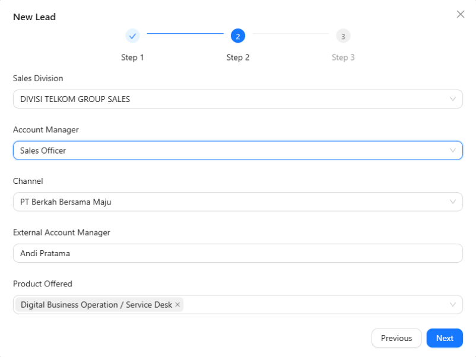 
  
   <em>Gambar: Tahapan pengisian Lead (Step 1 - 3)</em>

--- 

#### **B. Impor Lead**
Selain manual, Anda dapat mengimpor data dalam jumlah besar menggunakan file Excel.

**Langkah-Langkah:**

1. Pada halaman **lead**, Klik tombol **`Import Lead`**.
2. Pada pop-up yang muncul, klik **Download Template** untuk mendapatkan format Excel yang sesuai.
   *Pastikan mengisi data sesuai kolom yang tersedia di template tersebut.*
3. Isi kolom **Period**.
4. unggah file dari perangkat Anda dengan cara **Drag & Drop** atau klik area unggah pada jendela yang sama kemudian Klik **`Upload`** untuk memproses data. 
5. Klik **Import to Database**.

  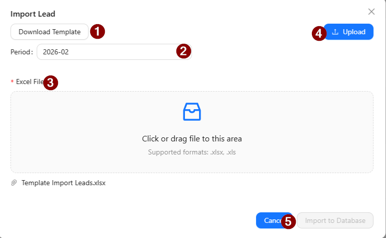
  
<i>Gambar: Form Import Lead</i>

---

### 3.1.3 Pengelolaan Dokumen & Confidence Level
Untuk menjaga validitas prospek, Anda wajib memperbarui data secara berkala.

#### **A. Memperbarui Data & Confidence Level**
1. Buka halaman detail Lead, lalu klik tombol **`Edit`** pada bagian **Lead Information**.
   
2. Ubah informasi yang diperlukan atau sesuaikan persentase pada bagian **Confidence Level**.

3.  Klik tombol **`Save`** untuk menyimpan perubahan.

  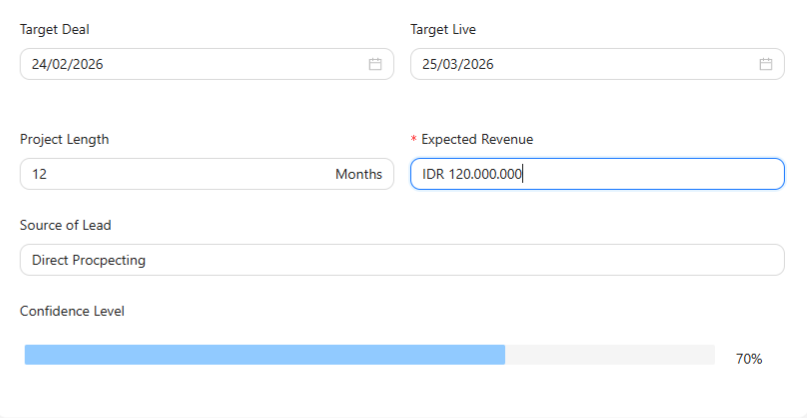
  
<i>Gambar: Form Update Lead</i>

---

#### **B. Mengelola Dokumen Pendukung**
1. Pada halaman detail Lead, pilih tab **Documents**.

2. Klik ikon **`+ Add Document`** untuk menambahkan berkas baru seperti Proposal, BAKN, SPH, atau dokumen lainnya.

  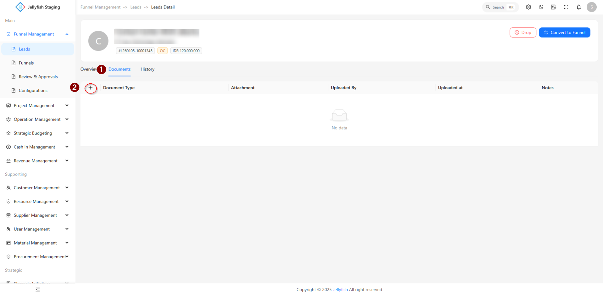
  
<i>Gambar: Tab Document</i>

3. **Pop-up Unggah Dokumen** akan muncul isi kolom, pilih jenis, dan lampirkan file dari perangkat Anda.

4. Klik tombol **` Save `** pada jendela pop-up untuk menyelesaikan proses.

  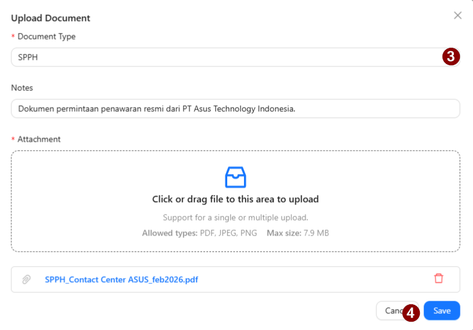
  
<i>Gambar: Form Upload Document</i>

> [!IMPORTANT]
> **Akses Edit:** Tombol **` Edit `** dan **` Upload `** hanya tersedia selama Lead berstatus **Draft** atau **Active**.

> [!TIP]
> Pastikan format dokumen yang diunggah sesuai dengan ketentuan (PDF/JPEG,PNG) agar dapat dibuka melalui fitur *Preview*.

---

### 3.1.4 Convert to Funnel & Drop Lead
Langkah akhir dari siklus Lead adalah menentukan kelanjutan prospek:

#### **1. Convert to Funnel**
Jika prospek sudah divalidasi dan siap lanjut ke tahap penawaran formal, Anda dapat mengonversinya menjadi Funnel.

**Langkah-Langkah:**

1. Pada halaman detail Lead, klik tombol **`Convert to Funnel`**.

2. **Pop-up Konversi** akan muncul. Sistem akan menampilkan kembali form 3 tahap (Informasi, Penugasan, dan Finansial) untuk memastikan data telah sesuai.
  
   * Periksa kembali data pada **Step 1** dan **Step 2**, lalu klik **Next**.
   * Pada **Step 3**, pastikan estimasi finansial sudah sesuai.

3. Klik tombol **Save**.

  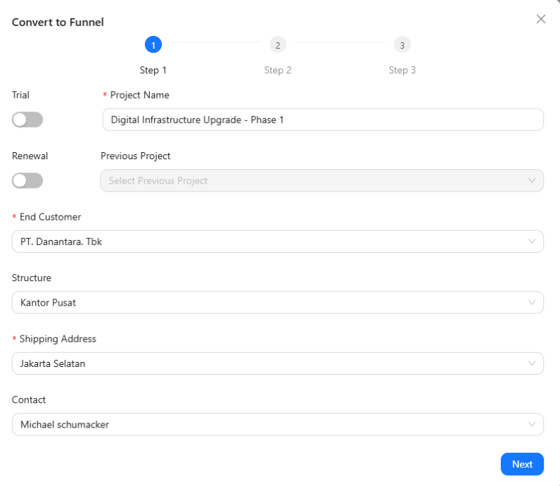 
  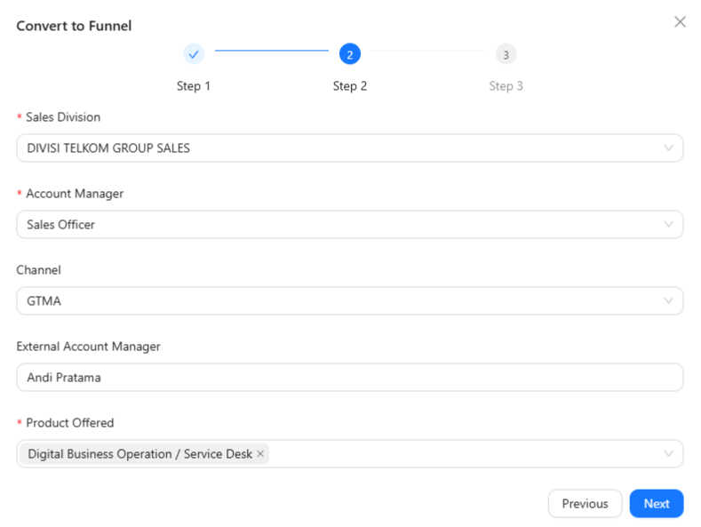 
  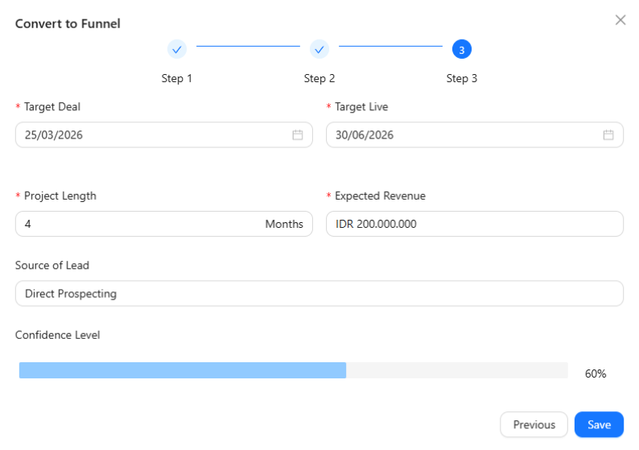
   <em>Gambar: Tahapan Convert Lead (Step 1 - 3)</em>

> [!NOTE]
> Setelah Lead di convert, Data otomatis berpindah ke menu **Funnel Management** dengan status awal **Prospect**.

---

#### **2. Drop Lead**
1. Pada halaman detail Lead, klik tombol **`Drop`**.
2. **Form Drop Funnel** akan muncul, isi alasan pembatalan.
3. Klik tombol **`Save`**.

  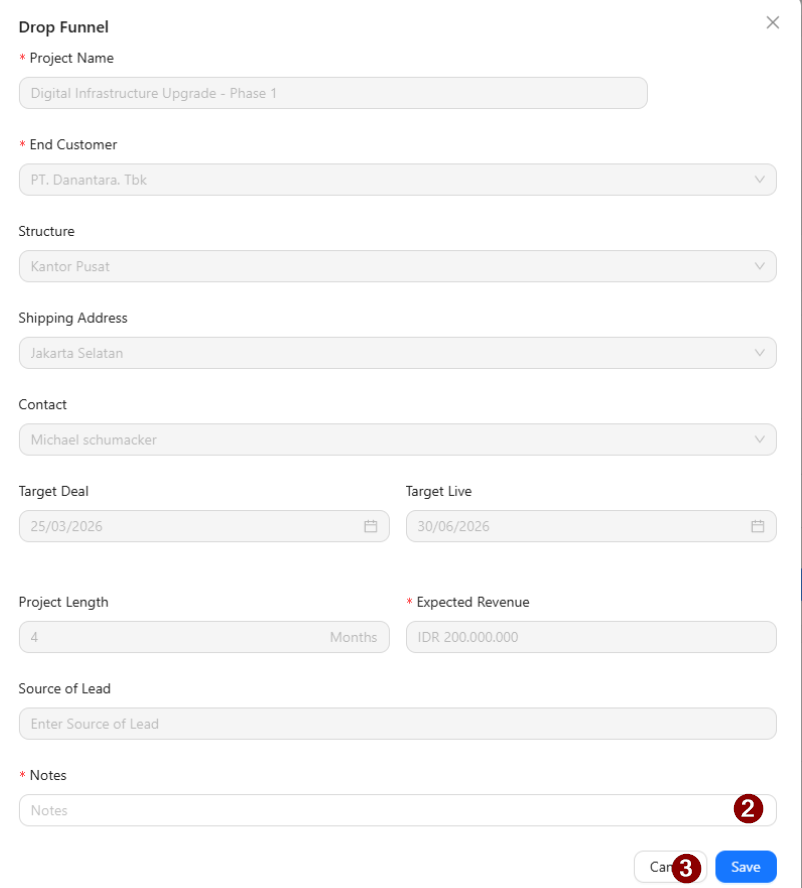
  
<i>Gambar: Form Drop Lead</i>

> [!NOTE]
> * **Status Lead:** Berubah menjadi **Dropped** dan siklus berhenti.

## **3.2 Menu Funnel**

Menu **Funnel** adalah pusat pengelolaan peluang bisnis yang telah divalidasi. Di sini, Anda akan mengelola siklus penjualan, merancang struktur biaya (CoGS), hingga mensimulasikan profitabilitas proyek sebelum diajukan ke tahap persetujuan.

### **3.2.1 Daftar & Monitoring Funnel**
Halaman ini menampilkan seluruh peluang yang sedang aktif maupun yang sudah selesai dalam sistem.

**Langkah-langkah:**
1. Pilih menu **Funnel Management** > **Funnel**.

  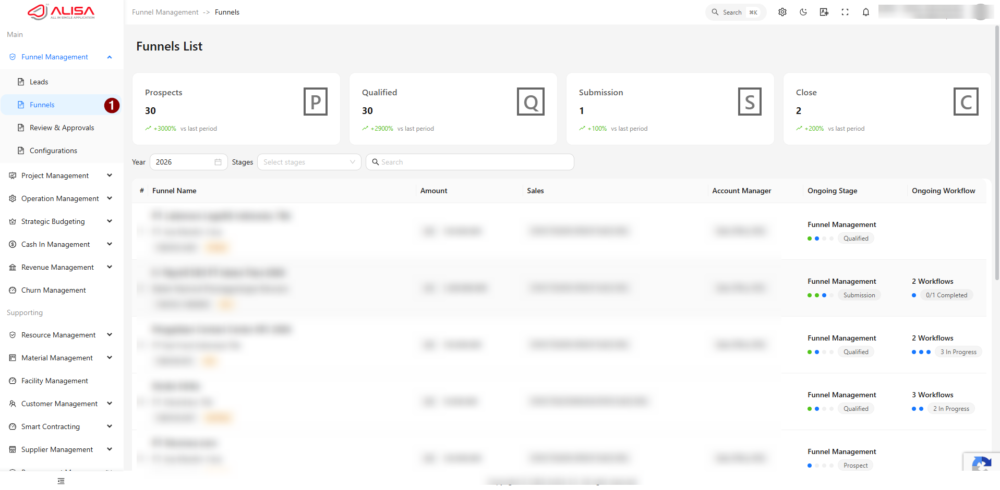
  
<i>Gambar: Halaman Funnel List</i>

2. Gunakan fitur **Filter** (Tahun, Status) atau kolom **Search** untuk mencari funnel spesifik.

  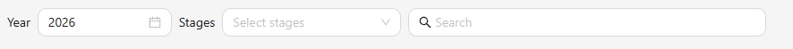
  
<i>Gambar: Filter Funnel </i>

> [!TIP]
> Klik salah satu **Nama Proyek** untuk masuk ke halaman **Detail Funnel**.

---

### **3.2.2 Pemahaman Stage & Workflow**
Terdapat beberapa bagian informasi untama yang ada pada halaman detail funnel:
1. **Lifecycle Stage:** Menampilkan posisi prospek saat ini (*Prospect* ➔ *Qualified* ➔ *Submission* ➔ *Close* ➔ *Done*). Setiap tahap memiliki **SLA (batas waktu)** yang terpampang di bagian atas.

  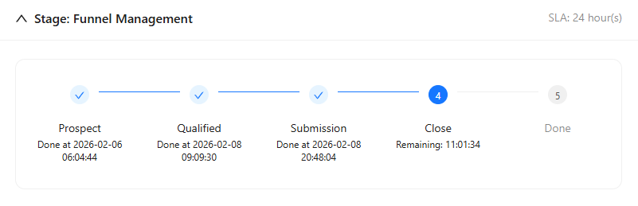
  
<i>Gambar: Stage Funnel </i>

2. **On-Going Workflow:** Menampilkan proses review internal yang berjalan secara paralel oleh pihak terkait.

  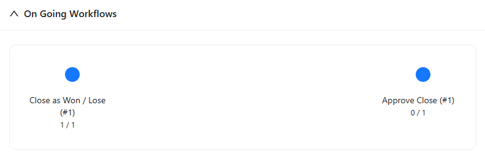
  
<i>Gambar: Workflow Funnel </i>

3. **Engagements (Schedules & Activities):**
   Menampilkan seluruh aktivitas interaksi dengan pelanggan. Di sini Anda dapat melihat ataupun menambah agenda mendatang (*Schedules*) dan riwayat aktivitas yang telah dilakukan (*Activities*). 
 

     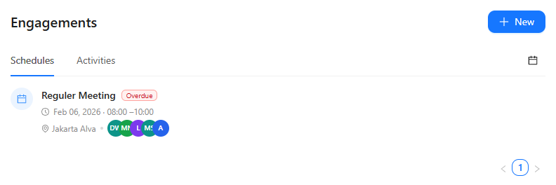
      <em>Gambar: Engagements Funnel</em>
   

4. **Tab Information:** Terdiri dari kumpulan tab detail seperti *Overview, Term of Payment, COGS, Feasibility, Review, Document,* dan *History* untuk pengelolaan data mendalam.
---

### **3.2.3 Menentukan Scope**
Sebelum melanjutkan ke tahap teknis, Anda harus mendefinisikan ruang lingkup proyek yang akan ditawarkan.

**Langkah - langkah**

1. Pilih tab **Scopes** > klik tombol **`Edit`**.
2. Tentukan klasifikasi proyek pada kolom berikut:
   * **Project Type:** Pilih *Delivery* atau *Operations*.
   * **Contract Type:** Pilih *Lumpsum* atau *Single Price Contract (KHS)*.
3. Masukkan **Description / Internal Notes** sebagai penjelasan ringkas mengenai proyek tersebut.
4. Pada bagian **Deliverables**, lengkapi kolom item pekerjaan:
   * Tulis nama **Deliverables (Item Pekerjaan)**.
   * Klik ikon **` + `** untuk menambah baris produk.
   * Pilih **Product**, masukkan **Selling Price**, dan tentukan **Material Group**.
5. Setelah semua data terisi, klik tombol **` Save `** di pojok kanan atas.

  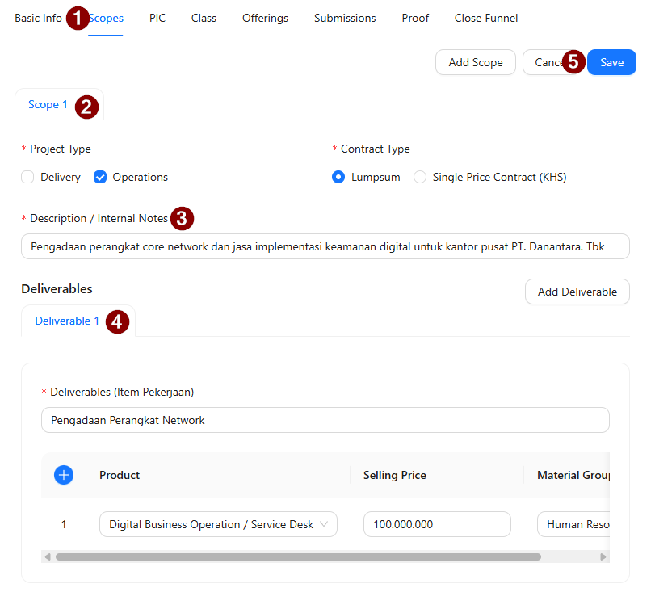
   <em>Gambar: Form Pengisian Detail Scope & Deliverables</em>

> [!TIP]
> **Penting!** Pastikan *Material Group* sudah sesuai, karena akan secara otomatis ada pada perhitungan di tab **COGS**.

### 3.2.4 Submit ke Stage Qualified
Setelah data dasar dan Scope selesai diisi, Funnel harus diajukan ke tahap **Qualified** untuk membuka proses persiapan finansial dan penugasan tim.

**Langkah-langkah:**
1. Pastikan status Funnel berada pada stage **Prospect**.
2. Pada tab **Overview**, pastikan bagian **Scopes** sudah terisi lengkap.
3. Masukkan catatan pada kolom **Notes** (Wajib diisi sebagai syarat audit).
4. Klik tombol **Submit**.

  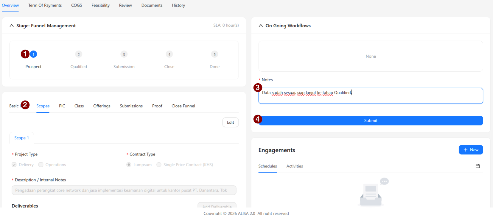
   <em>Gambar: Proses Submit Funnel dari Tahap Prospect ke Qualified</em>

> [!IMPORTANT]
> Setelah funnel menjadi **Qualified**, sistem akan membuka akses untuk pengisian **Resource Assignment (PIC & Class)** serta **Financial Preparation (ToP & COGS)**. Pastikan Scope sudah benar karena akan menjadi dasar perhitungan finansial.

---

### **3.2.4 Persiapan Finansial (CoGS & ToP)**
Setelah *Scope* ditentukan, langkah selanjutnya adalah menghitung rincian biaya dan rencana penagihan.

#### **1. Input CoGS (Cost of Goods Sold)**
Kelola komponen biaya (Material/Jasa) sebagai dasar perhitungan profitabilitas proyek. Data diinput berdasarkan *Material Group* yang telah ditentukan pada tahap *Scope*.

**Langkah-langkah:**
1. Pada halaman detail Funnel, pilih tab **COGS** > klik tombol **` Edit `**.
2. Klik ikon **` + `** pada Material Group yang tersedia untuk menambah komponen biaya.

  

    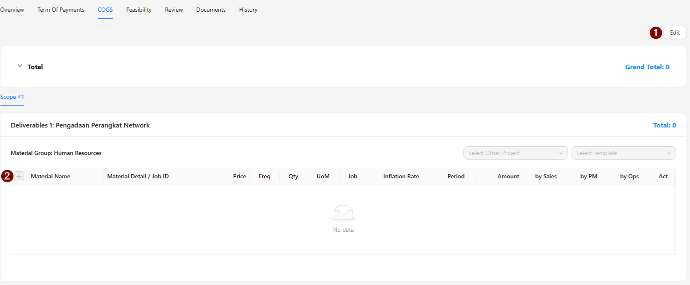
     <em>Gambar: Tab COGS (CoGS)</em>
  

3. **Pop-up Add Material** akan muncul. Lengkapi informasi pada tab-tab berikut:
   * **Material Informations:** Pilih detail material atau *Job Name*.
   * **Price Informations:** Input harga satuan dan frekuensi.
   * **Usage Informations:** Tentukan durasi atau jumlah penggunaan material/SDM.
  
4. Klik tombol **`Add`** untuk memasukkan komponen ke dalam daftar CoGS.
5. Setelah semua komponen terisi, klik **` Save `** pada halaman utama CoGS.
  

    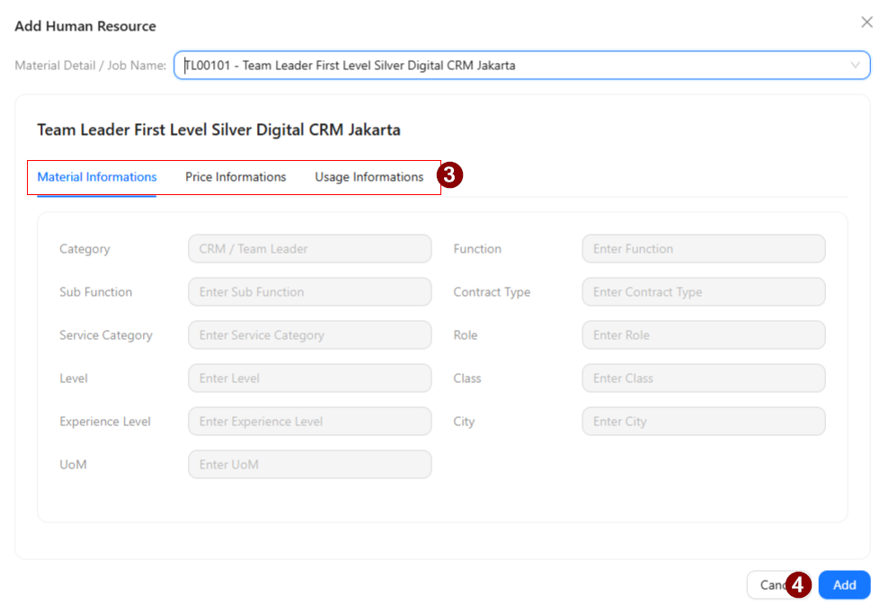
     <em>Gambar: Form Input Material Group</em>
  

--- 

#### **2. Update Term of Payment (ToP)**
Atur skema pembayaran proyek yang akan menjadi dasar simulasi finansial. Sistem mewajibkan total input pembayaran sesuai dengan nilai proyek agar data dapat disimpan.

**Langkah-langkah**

1. Pada halaman detail Funnel, pilih tab **Term of Payment** > klik **` Edit `**.
2. Isi skema pembayaran pada kolom yang tersedia:
   * **Down Payment:** Jika terdapat uang muka di awal.
   * **One Time Charge:** Untuk biaya yang dibayarkan satu kali.
   * **Recurring:** Untuk biaya berlangganan.
  
  

    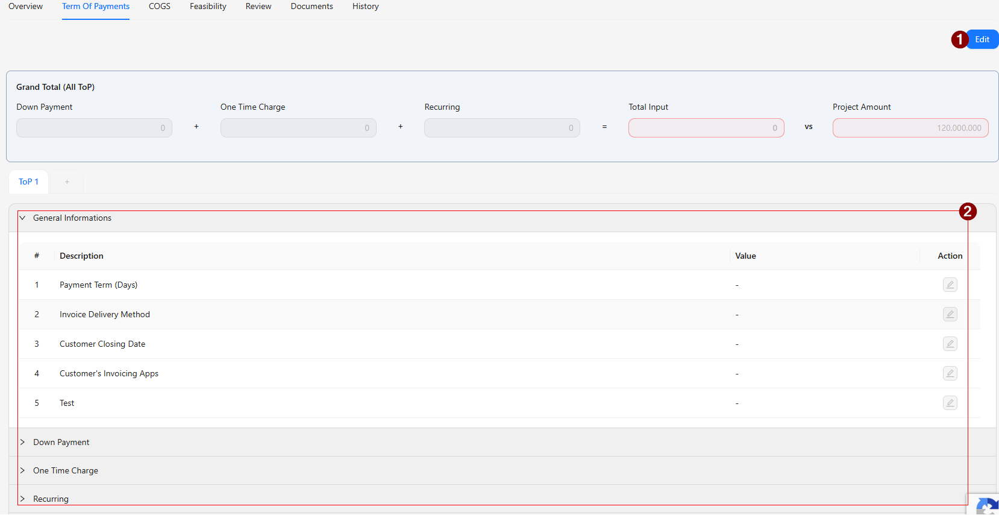
     <em>Gambar: Mode Edit dan Pengisian Skema ToP</em>
  

3. periksa dan pastikan nilai **Total Input** sama dengan **Project Amount**.
4. klik **` Save `**.
   
  

    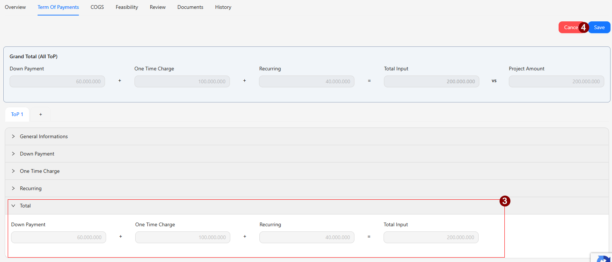
     <em>Gambar: Total Input ToP</em>
  

---

### **3.2.5 Simulasi Finansial**
Tinjau hasil kalkulasi finansial proyek Anda secara otomatis. 
Data yang tampil di sini merupakan hasil integrasi dari input COGS dan Term of Payment.

**Langkah-Langkah**

1. Pilih tab **Feasibility** pada halaman detail Funnel.
2. Tinjau ringkasan parameter finansial yang muncul untuk memastikan proyek memenuhi kriteria perusahaan:
   * **Gross Margin:** Melihat persentase keuntungan kotor yang dihasilkan.
   * **Project Health:** Memantau indikator kelayakan finansial proyek.
   * **Cash Flow Analysis:** Memeriksa proyeksi arus kas masuk dan keluar berdasarkan skema pembayaran yang **Anda** susun.

  

    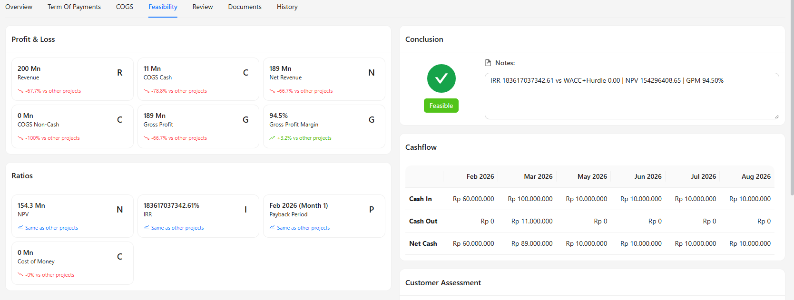
     <em>Gambar: Tampilan Simulasi Kelayakan Finansial Proyek</em>
  

> [!NOTE]
> Seluruh angka di tab ini bersifat *read-only*. Jika **Anda** perlu melakukan penyesuaian nilai, silakan kembali ke tab **COGS** atau **Term of Payment** untuk melakukan perubahan data sumber.

---

### **3.2.6 Offering, Submission, & Negosiasi**
Setelah simulasi finansial selesai, **Anda** perlu melengkapi dokumen penawaran resmi dan bukti interaksi dengan pelanggan melalui langkah-langkah berikut:

#### **A. Offering Letter**
Gunakan bagian ini untuk menyiapkan surat penawaran resmi, baik menggunakan template sistem maupun dokumen yang sudah **Anda** miliki.

1. Pilih sub-tab **Offerings** lalu klik tombol **`+`**.

  

    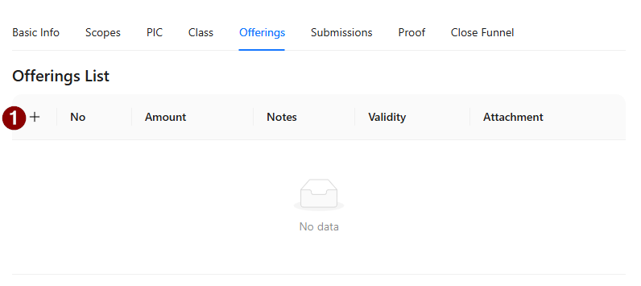
     <em>Gambar: Sub-Tab Offerings</em>
  

2.  **Pop-up Create Funnel Offering** akan muncul, lengkapi kolom pada form.
3.  Pilih metode pembuatan dokumen: 
    * **Use Template** untuk menggunakan template dari sistem.
    * **Upload** untuk melampirkan file dari perangkat **Anda**
4. Klik **` Save `** untuk menyimpan dokumen penawaran.

  

    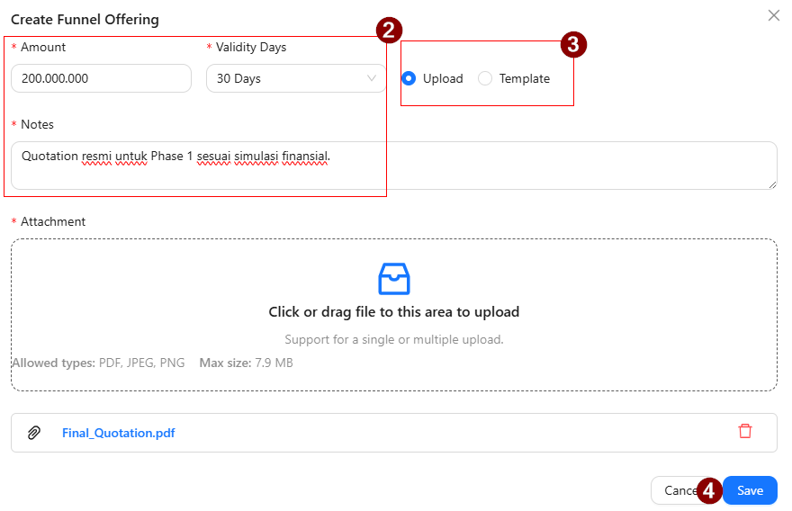
     <em>Gambar: Form Penambahan Offering Letter</em>
  

---

#### **B. Submission**
Catat riwayat pengiriman dokumen agar *timeline* interaksi **Anda** terekam dengan akurat di dalam sistem.

**Langkah-langkah:**

1. Pilih sub-tab **Submission** lalu klik tombol **`+`**.

  

    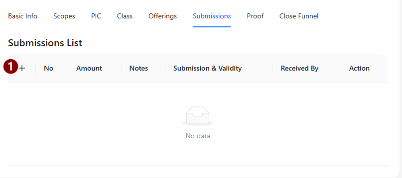
     <em>Gambar: Sub-tab Sumissions</em>
  

2.  **Pop-up Add Funnel Submission** akan muncul, lengkapi kolom dan upload dokumen pada form.
3. Klik **` Save `** untuk mencatat riwayat pengiriman.

  

    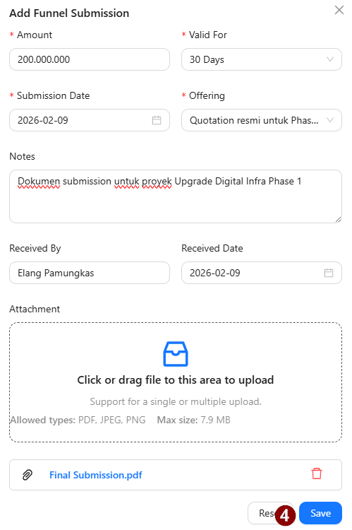
     <em>Gambar: Form Penambahan Funnel Submission</em>
  

---

#### **C. Negotiation Proof**
Unggah bukti kesepakatan akhir sebagai dasar validasi manajemen sebelum **Anda** menyelesaikan tahapan Funnel.

**Langkah-langkah:**

1. Pilih sub-tab **Proof** lalu klik tombol **`Edit`**.
  

    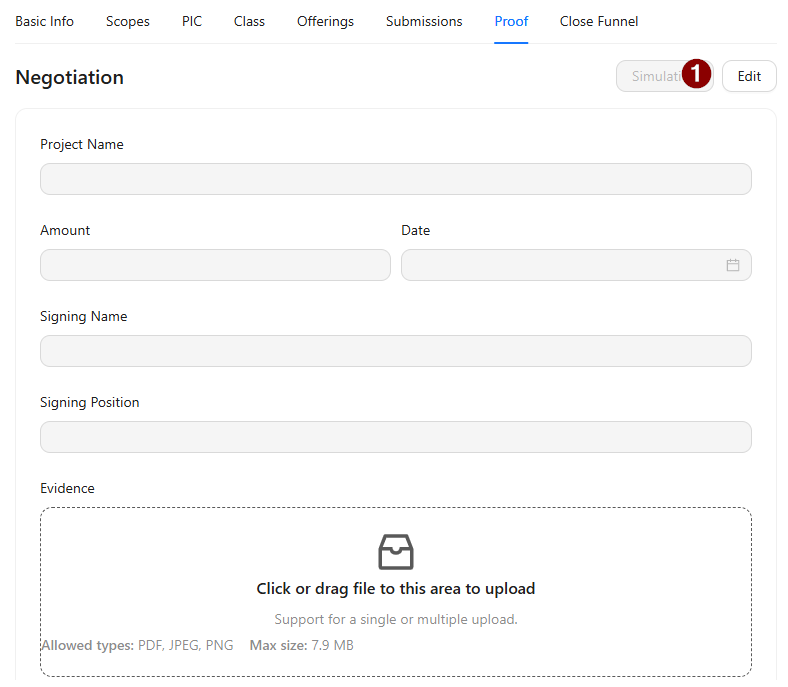
     <em>Gambar: Proses penambahan Bukti Negosiasi Akhir</em>
  

2. lengkapi kolom dan Unggah bukti interaksi seperti email konfirmasi, notulensi, atau dokumen hasil negosiasi lainnya.
   
3. Klik **` Save `**  untuk mengunggah dokumen.

  

    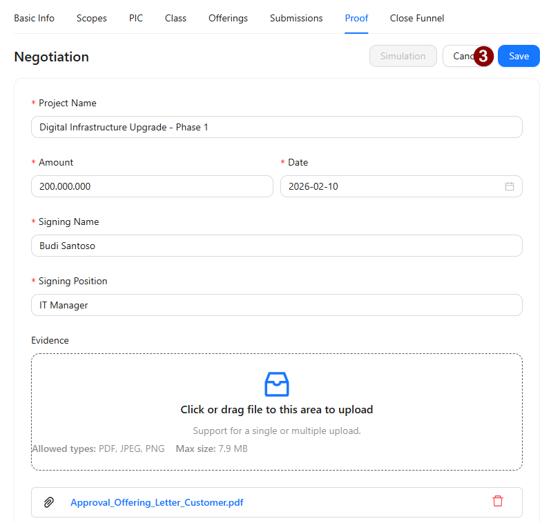
     <em>Gambar: Form Bukti Negosiasi Akhir</em>
  

> [!TIP]
> **Anda** disarankan menggunakan format PDF/JPEG/PNG untuk setiap unggahan agar dokumen mudah dibuka dan ditinjau oleh pihak verifikator.
---

### 3.2.7 Close Funnel
Lengkapi data penutupan Funnel untuk menetapkan status akhir **Won** atau **Lose** sebelum proses persetujuan akhir dilakukan melalui menu *Review & Approvals*.

**Langkah-langkah:**

1. Pilih sub-tab **Close Funnel** pada halaman detail Funnel.

  

    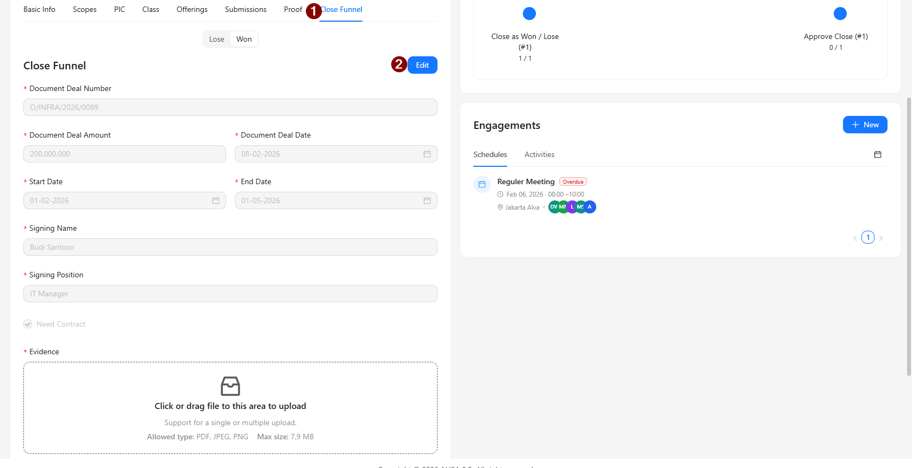
     <em>Gambar: Sub-tab Close Funnel</em>
  

2. Klik tombol **`Edit`**.
3. Pilih status akhir Funnel, yaitu **Won** atau **Lose**.
4. Lengkapi seluruh kolom yang tersedia, dan upload dokumen pendukung.
5. Klik **`Save`** untuk menyimpan data Close Funnel.

  

    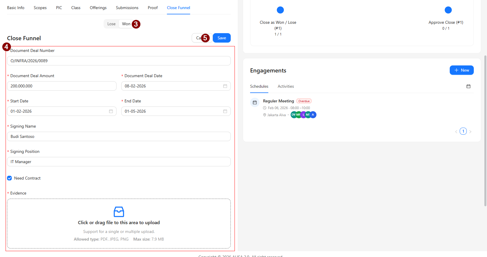
     <em>Gambar: Form Close Funnel</em>
  

> [!NOTE]
> Status akhir Funnel (**Won/Lose**) akan ditetapkan setelah proses persetujuan dilakukan melalui menu **Review & Approvals**.

## **3.4 Menu Review & Approval**

Menu ini merupakan pusat validasi lintas divisi untuk memastikan setiap peluang bisnis telah memenuhi standar kelayakan teknis, finansial, dan kepatuhan. 

Sebagai **Reviewer** atau **Approver**, **Anda** bertanggung jawab untuk memberikan keputusan yang akurat guna memitigasi risiko sebelum proyek berlanjut ke tahap komitmen formal.

Setiap tugas pada menu ini memiliki **SLA (Service Level Agreement)** tertentu (umumnya 24 hingga 48 jam). 

### **3.4.1 Melihat Daftar Review & Approval**
Halaman ini menampilkan seluruh daftar Funnel yang memerlukan tindakan peninjauan atau persetujuan. 

**Anda** dapat memantau status pengajuan dan memastikan setiap tugas diselesaikan sesuai dengan batas waktu (SLA) yang ditentukan.

**Langkah-langkah:**

1. Pada halaman utama sistem, pilih menu **Funnel Management**.
2. Pilih sub-menu **Review & Approval**.
3. Sistem akan menampilkan daftar Funnel yang sedang dalam antrean peninjauan.

  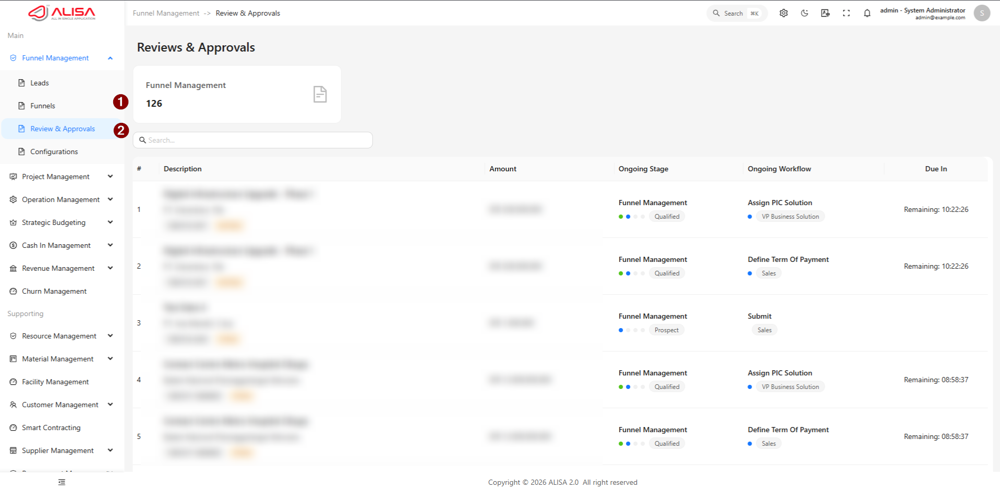
   <em>Gambar: Daftar Review & Approval</em>

4. Gunakan kolom **Search** untuk mencari funnel berdasarkan nama pelanggan atau nama proyek.

  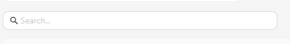
  
<i>Gambar: Search Funnel </i>

> [!TIP] 
> Perhatikan kolom **SLA** pada daftar ini. Pastikan **Anda** segera memproses Funnel yang mendekati batas waktu agar tidak menghambat siklus penjualan.

---

### **3.4.2 Assign PIC Solution**
Tahap ini muncul segera setelah Funnel dinyatakan **Qualified**. Penugasan ini bertujuan menentukan tim teknis yang akan bertanggung jawab menyusun rincian solusi dan simulasi finansial.

**Langkah-langkah:**

1. Pilih menu **Review & Approval**.
2. Pilih Funnel yang berada pada workflow **Assign PIC Solution**.

  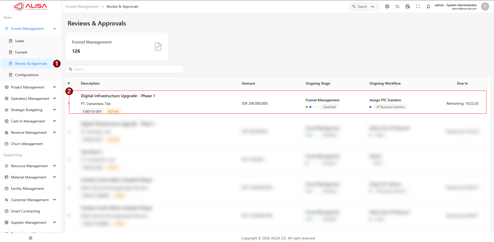
   <em>Gambar: Workflow Assign PIC Solution</em>

3. Pada panel detail, **pilih** personel yang sesuai pada kolom **Assign (Business Solution)**.
4. Tambahkan catatan pada kolom **Notes** jika ada instruksi khusus mengenai pengerjaan solusi teknis.
5. Klik **` Approve `** untuk memvalidasi dan mengirim notifikasi tugas ke PIC tersebut.

  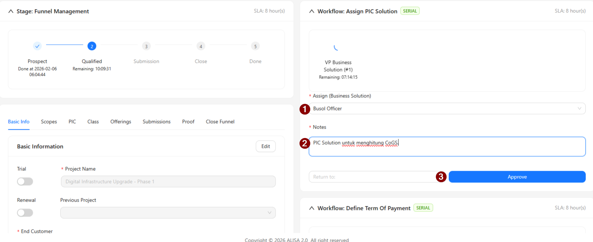
   <em>Gambar: Proses Penentuan PIC Solution</em>

---
### **3.4.3 Choose OPS Division**
Tahap ini muncul segera setelah Funnel dinyatakan **Qualified**. Penugasan ini bertujuan menentukan tim teknis yang akan bertanggung jawab menyusun rincian solusi dan simulasi finansial.

**Langkah-langkah:**

1. Pilih menu **Review & Approval**.
2. Pilih Funnel yang berada pada workflow **Choosee OPS Division**.

  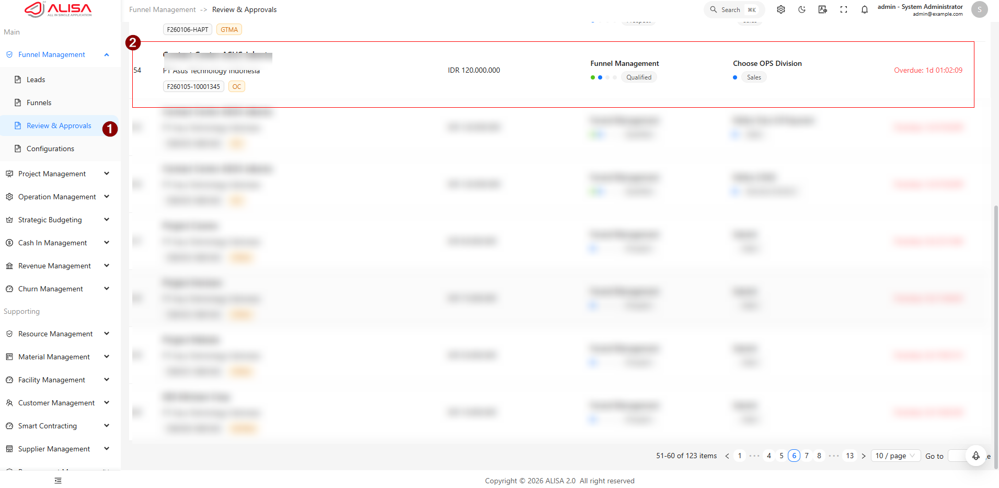
   <em>Gambar: Workflow Choose OPS Division</em>

3. Pada panel workflow, **pilih** personel yang sesuai pada kolom **Assign (Operations Division)**.
4. Tambahkan catatan pada kolom **Notes**.
5. Klik **` Approve `** untuk memvalidasi dan mengirim notifikasi tugas ke PIC tersebut.

  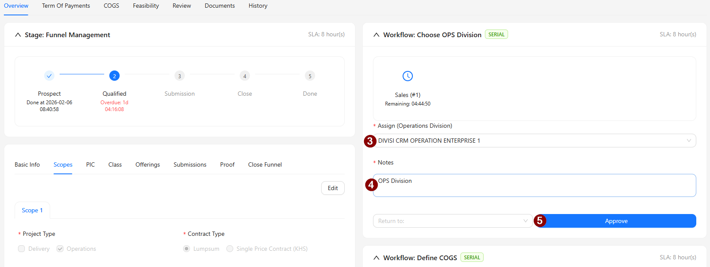
   <em>Gambar: Proses Penentuan OPS Division</em>

---

### **3.4.4 Assign Ops Department**
Tahap ini khusus untuk Funnel bertipe **Operation**. Penugasan ini memastikan departemen operasional terkait sudah teralokasi untuk mengelola proyek.

**Langkah-langkah:**

1. Pilih menu **Review & Approval**.
2. pilih Funnel yang berada pada workflow **Assign Ops Departemen**.

  

    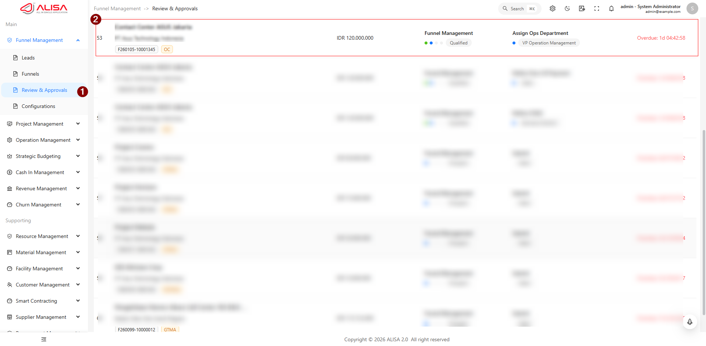
     <em>Gambar: Workflow Assign Ops Departement (Khusus Tipe Operation)</em>
  

3. Pada panel workflow, **pilih** personel yang sesuai pada kolom **Assign (Operations Departement)**.
4. Masukkan catatan terkait lingkup operasional pada kolom **Notes**.
5. Klik **` Approve `** untuk menyimpan penugasan dan mengirim notifikasi ke departemen terkait.

  

    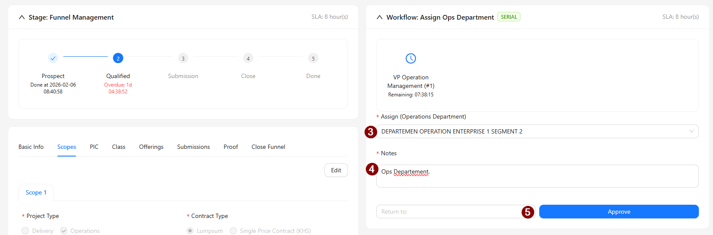
     <em>Gambar: Proses penentuan Operation Departement (Khusus Tipe Operation)</em>
  

---

### **3.4.7 Assign PIC Project Planning**
Tahap ini khusus untuk Funnel bertipe **Delivery**. Penugasan ini bertujuan menentukan personel yang akan bertanggung jawab menyusun rencana kerja dan jadwal implementasi proyek.

**Langkah-langkah:**
1. Pada menu **Review & Approval**.
2. Pilih Funnel dengan status workflow **Assign PIC Project Planning**.

  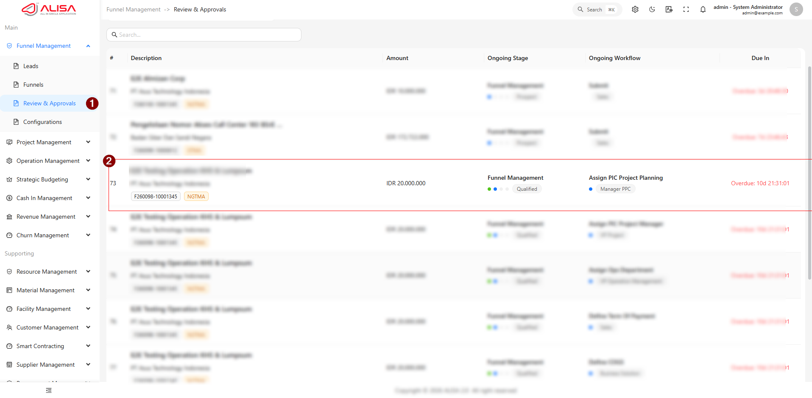
   <em>Gambar: Workflow Assign PIC Project Planning</em>

3. Pada panel workflow, **pilih** nama personel yang akan ditugaskan sebagai PIC Planning.
4. Tambahkan catatan pada kolom **Notes** jika terdapat instruksi khusus terkait perencanaan proyek.
5. Klik **` Approve `** untuk memvalidasi penugasan dan melanjutkan ke tahap berikutnya.

  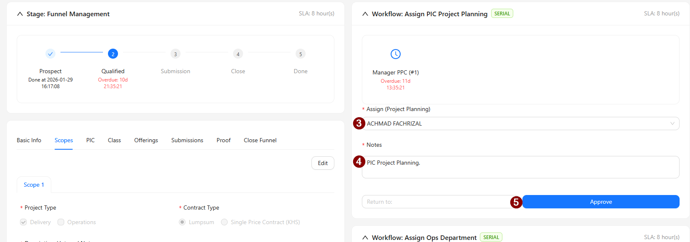
   <em>Gambar: Penugasan PIC untuk Tahap Perencanaan Proyek</em>

> [!NOTE]
> Setelah penugasan disetujui, sistem akan mengirimkan notifikasi otomatis kepada PIC yang terpilih agar dapat segera menyusun perencanaan proyek.

--- 

### **3.4.4 Assign Project Manager (PM)**
Tahap ini dilakukan khusus untuk proyek tipe **Delivery** dengan kategori **High** untuk menentukan siapa yang akan memimpin pelaksanaan proyek.

1. Pilih menu **Review & Approval**.
2. PIlih Funnel dengan status **Assign Project Manager**.
   

  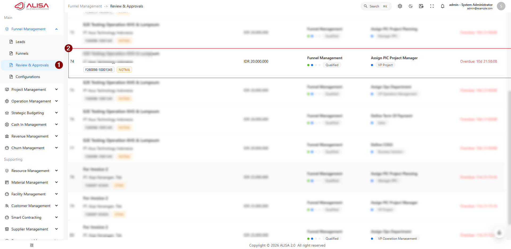
   <em>Gambar: Assign Project Manager</em>

1. Pada panel Workflow, **pilih** nama Project Manager yang akan ditugaskan.
2. Tambahkan catatan pada kolom **Notes**.
3. Klik **` Approve `** untuk menyimpan penugasan dan mengirimkan notifikasi penugasan kepada PM terkait.

  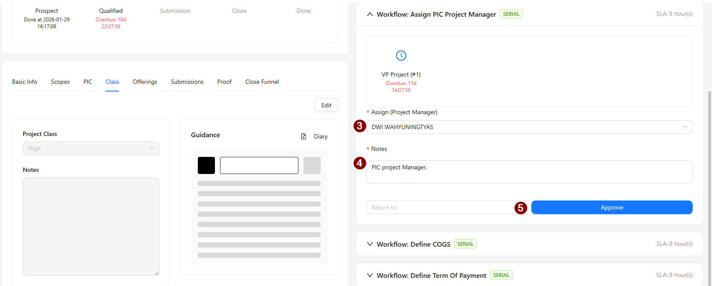
   <em>Gambar: Penugasan Project Manager untuk Proyek Kategori High</em>

--- 

### **3.4.5 Persetujuan (Define) CoGS**
Tahap ini digunakan untuk meninjau dan menyetujui rincian biaya proyek yang telah disusun oleh PIC Solution/Sales.

**Langkah-langkah:**

1. Pilih menu **Review & Approval**.
2. Pilih Funnel dengan status workflow **Define CoGS**.

  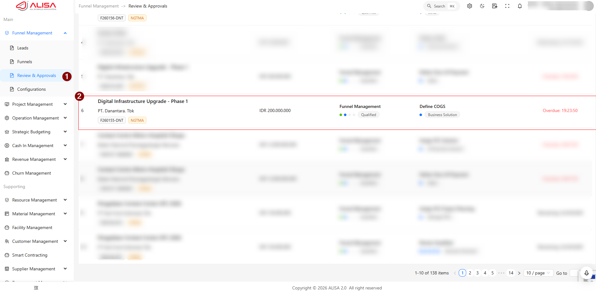
   <em>Gambar: Workflow Persetujuan Rincian Biaya (CoGS)</em>

3. Pilih tab **COGS** untuk memeriksa detail biaya yang telah diinput.
4. Kembali ke tab **Overview**, lalu berikan catatan penilaian pada kolom **Notes**.
5. Klik **` Approve `** untuk memvalidasi nilai CoGS dan melanjutkan ke tahap berikutnya.

  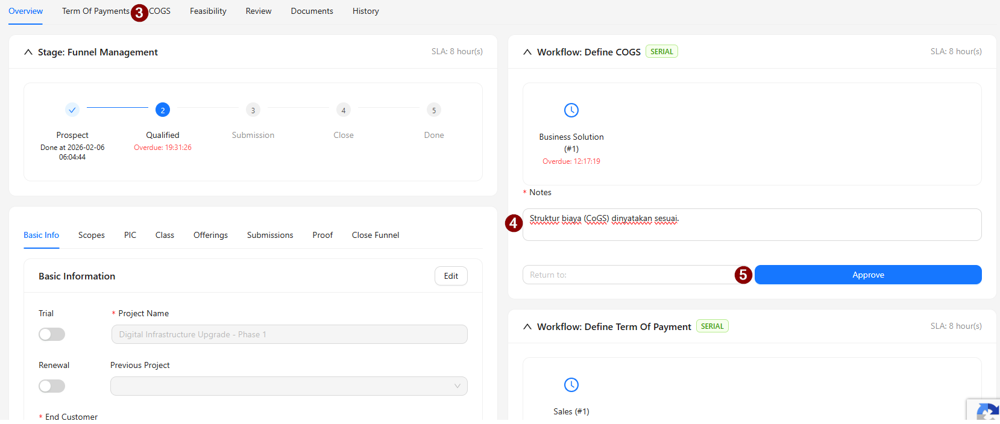
   <em>Gambar: Proses Persetujuan Rincian Biaya (CoGS)</em>

---

### **3.4.6 Persetujuan (Define) Term of Payment**
Tahap ini digunakan untuk meninjau dan menyetujui skema termin pembayaran yang telah diajukan.

**Langkah-langkah:**

1. Pilih menu **Review & Approval**.
2. Pilih Funnel dengan status workflow **Define Term Of Payment**.

  

    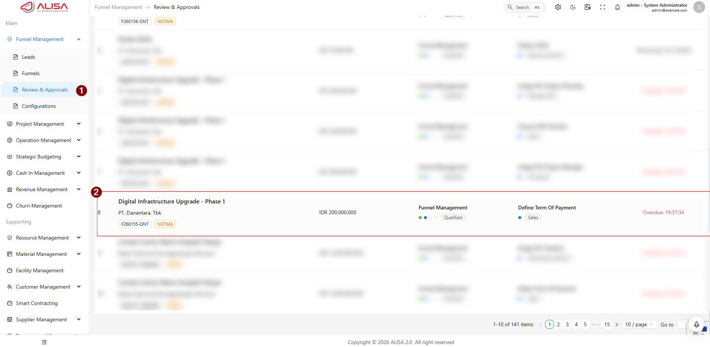
     <em>Gambar: Workflow Persetujuan Termin Pembayaran (ToP)</em>
  

3. Pilih tab **Term Of Payment** untuk memeriksa jadwal dan persentase penagihan.
4. Kembali ke tab **Overview**, lalu isi kolom **Notes**.
5. Klik **` Approve `** untuk memvalidasi skema pembayaran tersebut.

  

    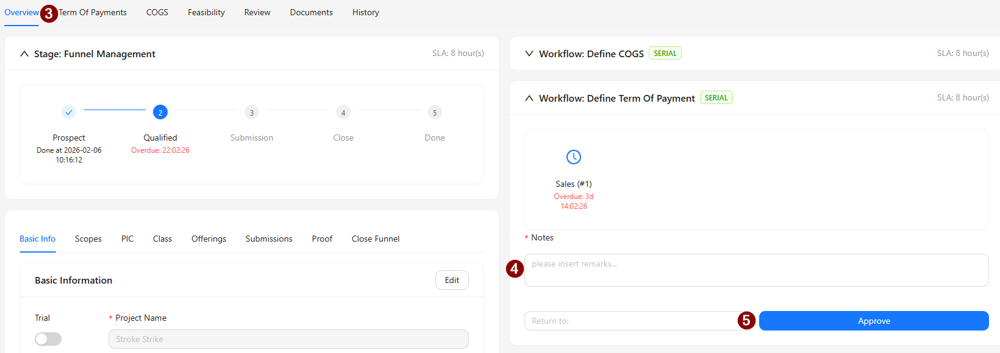
     <em>Gambar: Proses Persetujuan Termin Pembayaran (ToP)</em>
  

--- 

### **3.4.6 Scaling Review**
Pada tahap ini, **Anda** melakukan peninjauan terhadap proporsi nilai **Scaling** (pengembangan) dan **Sustain** (pemeliharaan) pada proyek yang diajukan.

1. Pilih menu **Review & Approval**.
2. Pilih Funnel dengan status workflow **Scaling**.
  
  

    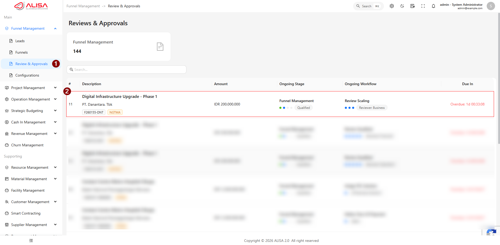
     <em>Gambar: Workflow Scaling</em>
  

3. Kemudian klik tombol **` Edit `** pada bagian sub tab **Scaling Review**.
  

    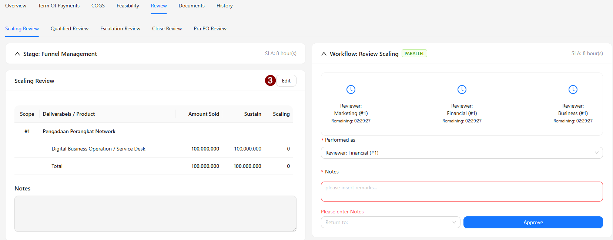
     <em>Gambar: Sub Tab Scaling Review</em>
  

4. Isi atau sesuaikan nilai proporsi scaling sesuai analisis bisnis **Anda**.
5. Klik **` Save `**.
6. Pada panel Workflow, **pilih** peran **Anda** pada kolom **Performed as** (Business atau Marketing).
7. Masukkan catatan pada kolom **Notes**
8. Klik **` Approve `** untuk memvalidasi hasil review.

  

    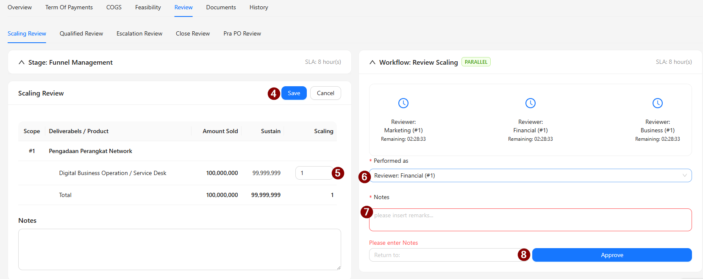
     <em>Gambar: Form Scaling</em>
  

> [!TIP]
> Langkah ini berlaku sama untuk peran Business maupun Marketing. Setelah disetujui, Funnel akan otomatis berlanjut ke tahap Qualified Review.

---

### **3.4.7 Qualified Review**
Ini adalah tahap penilaian kelayakan proyek secara mendalam yang dilakukan secara paralel oleh berbagai divisi (Business, Delivery, Compliance, Finance, dan Operation).

1. Pilih menu **Review & Approval**.
2. pilih Funnel dengan status workflow **Qualified**.

 

    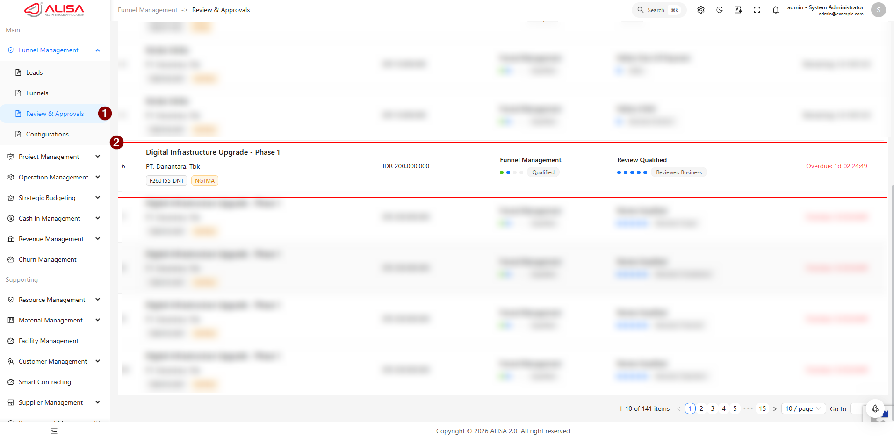
     <em>Gambar: Workflow Qualified Review</em>
  

3. Pada panel workflow, **pilih** peran **Anda** pada kolom **Performed as**.
4. Klik tombol **` Edit `** pada bagian sub tab **Qualified Review** untuk menampilkan form penilaian sesuai peran **Anda**.
  

      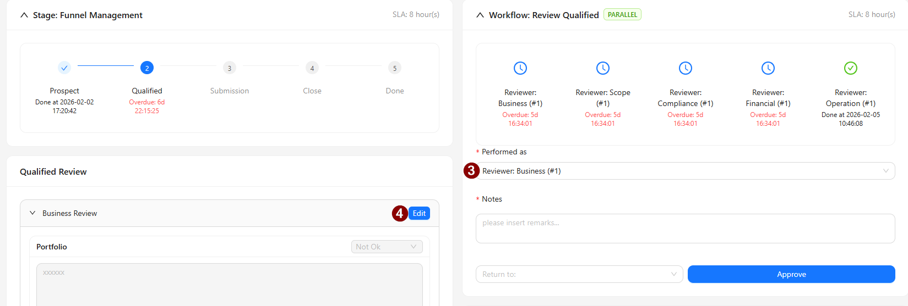
       <em>Gambar: Sub Tab Qualified Review</em>
    

5. Pada setiap kriteria yang muncul, **pilih** status **OK** atau **Not OK**.
6. Berikan catatan tambahan pada kolom **Notes** jika diperlukan.
7. Klik **` Save`** untuk meyimpan hasil penilaian.
8. Masukkan catatan pada kolom **Notes** untuk penilaian.
9. Klik **` Approve `** untuk menyetujui. 
   
  

    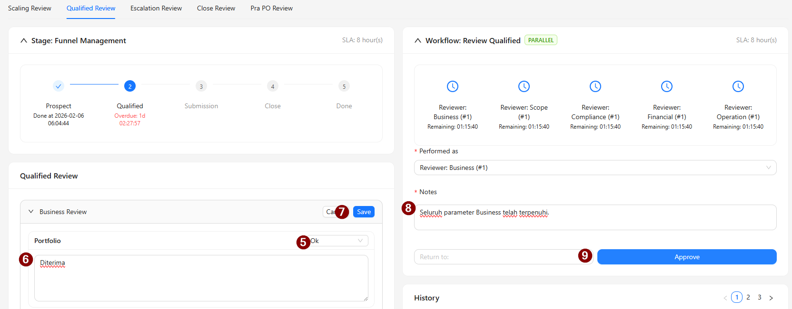
     <em>Gambar: Form Approval Qualified Review</em>
  

> [!CAUTION]
> jika terdapat **setidaknya satu** divisi yang memberikan penilaian **Not OK**, sistem akan otomatis memicu alur **Escalation Review**. Pastikan **Anda** memilih peran (*Performed as*) yang benar sebelum memulai pengeditan.

### **3.4.8 Persetujuan (Create) Funnel Offering**
Pada tahap ini, **Anda** (sebagai VP/GM Sales) melakukan validasi terhadap dokumen penawaran (Offering) sebelum diajukan secara resmi kepada pelanggan.

1. Pilih menu **Review & Approval**.
2. Pilih funnel dengan status workflow **Create Funnel Offering**.
3. Pilih sub-tab **Offering**, lalu klik ikon **preview** untuk memeriksa isi dokumen penawaran.
4. Setelah data dipastikan sesuai, Isi kolom **Notes** pada panel **Workflow – Create Funnel Offering**.
5. Klik **` Approve `** untuk menyetujui penawaran dan melanjutkan ke tahap berikutnya.

  

    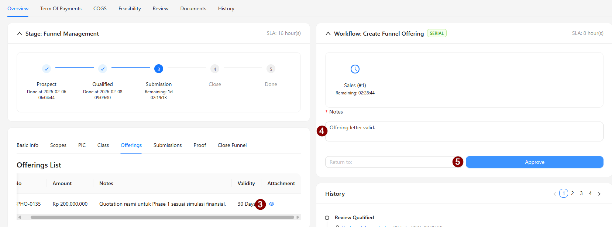
     <em>Gambar: Validasi Dokumen Penawaran oleh VP/GM Sales</em>
  

---

### **3.4.10 Close Review**
Ini adalah tahap pengecekan dokumen penutupan dan ruang lingkup proyek sebelum Funnel dinyatakan selesai (*Done*).

**Langkah - langkah**

1. Pilih menu **Review & Approval**.
2. pilih Funnel dengan status workflow **Close**.

 

    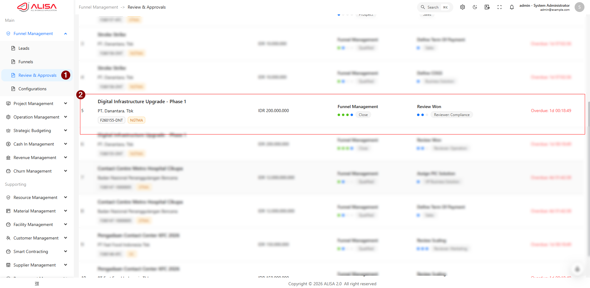
     <em>Gambar: Workflow Close</em>
  

3. Pada panel workflow, **pilih** peran **Anda** pada kolom **Performed as**.
4. Klik tombol **` Edit `** pada bagian sub tab **Close Review** untuk menampilkan form penilaian sesuai peran **Anda**.
  

      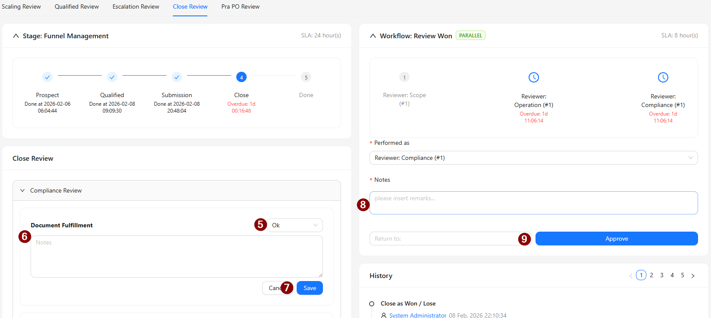
       <em>Gambar: Sub Tab Close Review</em>
    

5. Pada setiap kriteria yang muncul, **pilih** status **OK** atau **Not OK**.
6. Berikan catatan tambahan pada kolom **Notes** jika diperlukan.
7. Klik **` Save`** untuk meyimpan hasil penilaian.
8. Masukkan catatan pada kolom **Notes** untuk penilaian.
9. Klik **` Approve `** untuk menyimpan hasil review.

    
     <em>Gambar: Form Approval Close Review</em>
  

> [!CAUTION]
> **PENGUMUMAN DRAFT:**
> Dokumen ini merupakan **versi draf awal**. Konten di dalam modul **Review & Approval** belum mencakup seluruh alur (Eskalasi dan Pra-PO masih dalam pengerjaan). Menu **Configuration** belum tersedia pada versi ini.
